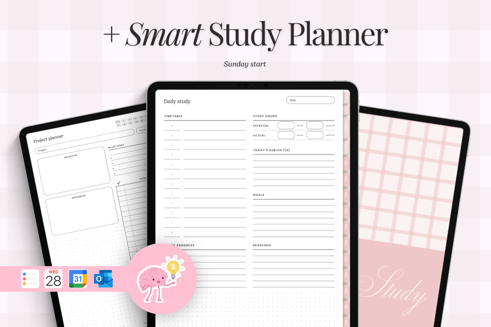

# Smart Study Planner

## Overview
Smart Study Planner is a client-side web application designed to help students overcome the challenges of organizing their study schedules and tracking academic tasks. It provides an intuitive, visually engaging interface for users to create, view, and manage their study goals, complete with reminders and progress tracking.

## Problem Statement
Students, especially in high school and university, often struggle with effective time management, leading to procrastination, missed deadlines, and increased stress. They lack a simple, dedicated tool to visualize their workload, prioritize tasks, and track progress over time.

## Features

### Core Task Management
- Create new tasks with title, subject, due date, priority level, and description
- View all pending tasks in a card-based layout
- Mark tasks as complete with visual feedback
- Edit existing tasks
- Delete tasks with confirmation

### Visual Timeline & Schedule View
- View tasks on a weekly calendar
- Visualize schedule with task cards organized by due date

### Progress Tracking & Motivation
- View completion percentage
- Dynamic progress visualization
- Task completion summary

### Data Persistence
- All data saved to browser's localStorage
- Automatic saving when tasks are modified

## UI/UX Design

### Look & Feel
- Modern, clean, and minimalist with a calming dark color palette
- Responsive three-column layout
- Clean typography using Inter font family

### Color Palette
- Background: Very dark grey (#1A1A2E)
- Card Background: Slightly lighter grey (#1F2840)
- Primary Accent: Vibrant blue (#4A6CFD)
- Priority Colors: High (#FF5C5C), Medium (#FFB800), Low (#00C49F)
- Text: Off-white (#F0F0F0)

### Animations & Micro-interactions
- Smooth task addition/deletion animations
- Elegant completion transitions
- Animated progress indicators
- Hover effects on interactive elements

## Technical Specifications
- Frontend: HTML5, CSS3, JavaScript (ES6+)
- Styling: CSS Flexbox/Grid, CSS Variables
- Data Storage: window.localStorage with JSON
- Architecture: Separate HTML, CSS, and JS files
- Compatibility: Modern browsers (Chrome, Firefox, Safari, Edge)

## Screenshots

### Dashboard

### Adding a New Task

### Task Completed

### Calendar View

### Settings

### Home Page
